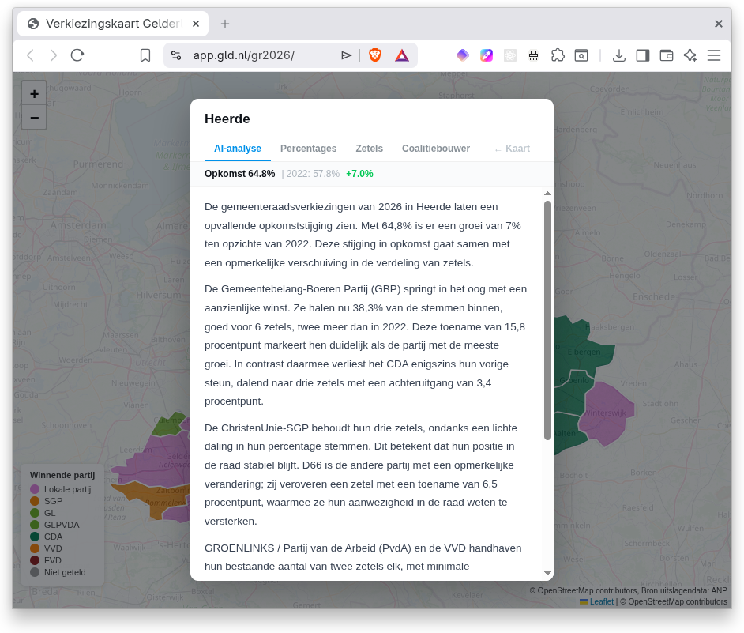
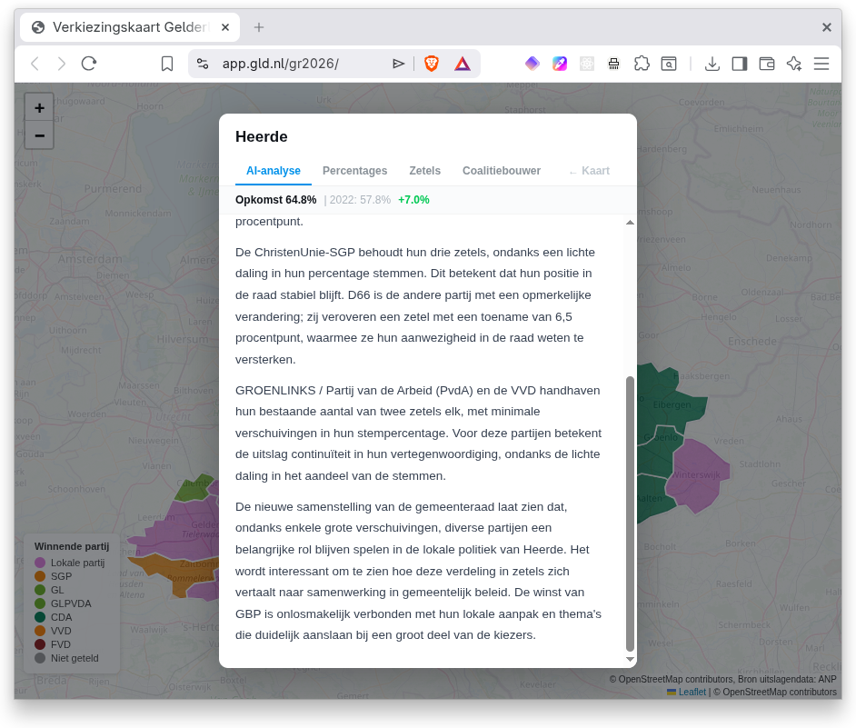
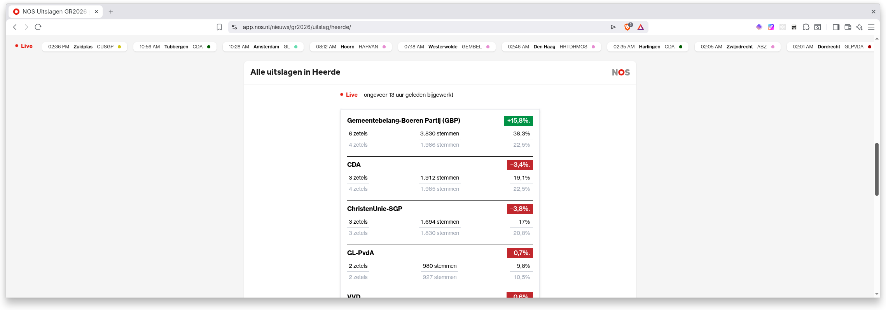
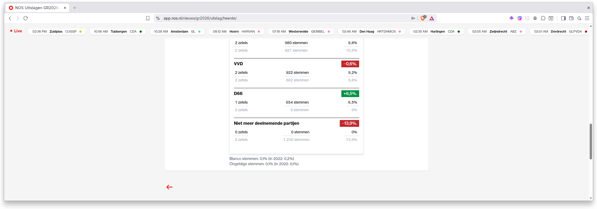

# When AI Describes Data but Misses the Story

*A Dutch regional broadcaster recently published an "AI analysis" of local election results. At first glance it reads well. The percentages are correct. The seat counts are accurate. The tone is professional. But it is not an analysis. It is a summary wearing a tie.*

<!-- more -->

## What the AI wrote

The regional broadcaster [Omroep Gelderland](https://www.gld.nl) used AI to generate analyses for all 51 municipalities in the province during the 2026 municipal elections. Their system feeds ANP election data (percentages, seats, turnout) into a language model with a journalistic prompt. The editorial team [tested over 350 generated texts](https://www.gld.nl/nieuws/8449877/omroep-gelderland-biedt-lokale-uitslagenanalyse-met-ai) and concluded: "the texts always match the data, AI does not hallucinate".

For the municipality of Heerde, this is what it produced (translated from Dutch):

> The 2026 municipal elections in Heerde show a notable rise in turnout. At 64.8%, there is a 7% increase compared to 2022. This rise in turnout coincides with a remarkable shift in the distribution of seats.
>
> The Gemeentebelang-Boeren Partij (GBP) stands out with a significant gain. They now capture 38.3% of the votes, good for 6 seats, two more than in 2022. This increase of 15.8 percentage points clearly marks them as the party with the most growth. In contrast, the CDA somewhat loses its previous support, declining to three seats with a decrease of 3.4 percentage points.
>
> The ChristenUnie-SGP retains its three seats, despite a slight decline in vote percentage. This means their position on the council remains stable. D66 is the other party with a notable change; they conquer a seat with an increase of 6.5 percentage points, strengthening their presence on the council.
>
> GROENLINKS / Labour Party (PvdA) and VVD maintain their existing count of two seats each, with minimal shifts in vote percentage. For these parties, the result means continuity in their representation, despite the slight decline in vote share.
>
> The new composition of the municipal council shows that, despite some major shifts, various parties continue to play an important role in local politics in Heerde. It will be interesting to see how this distribution of seats translates into cooperation in municipal policy. GBP's win is inextricably linked to their local approach and themes that clearly resonate with a large share of voters.

??? note "Original Dutch text"
    > De gemeenteraadsverkiezingen van 2026 in Heerde laten een opvallende opkomststijging zien. Met 64,8% is er een groei van 7% ten opzichte van 2022. Deze stijging in opkomst gaat samen met een opmerkelijke verschuiving in de verdeling van zetels.
    >
    > De Gemeentebelang-Boeren Partij (GBP) springt in het oog met een aanzienlijke winst. Ze halen nu 38,3% van de stemmen binnen, goed voor 6 zetels, twee meer dan in 2022. Deze toename van 15,8 procentpunt markeert hen duidelijk als de partij met de meeste groei. In contrast daarmee verliest het CDA enigszins hun vorige steun, dalend naar drie zetels met een achteruitgang van 3,4 procentpunt.
    >
    > De ChristenUnie-SGP behoudt hun drie zetels, ondanks een lichte daling in hun percentage stemmen. Dit betekent dat hun positie in de raad stabiel blijft. D66 is de andere partij met een opmerkelijke verandering; zij veroveren een zetel met een toename van 6,5 procentpunt, waarmee ze hun aanwezigheid in de raad weten te versterken.
    >
    > GROENLINKS / Partij van de Arbeid (PvdA) en de VVD handhaven hun bestaande aantal van twee zetels elk, met minimale verschuivingen in hun stempercentage. Voor deze partijen betekent de uitslag continuïteit in hun vertegenwoordiging, ondanks de lichte daling in het aandeel van de stemmen.
    >
    > De nieuwe samenstelling van de gemeenteraad laat zien dat, ondanks enkele grote verschuivingen, diverse partijen een belangrijke rol blijven spelen in de lokale politiek van Heerde. Het wordt interessant om te zien hoe deze verdeling in zetels zich vertaalt naar samenwerking in gemeentelijk beleid. De winst van GBP is onlosmakelijk verbonden met hun lokale aanpak en thema's die duidelijk aanslaan bij een groot deel van de kiezers.

Sounds plausible. Until you look at the absolute numbers.

## What the numbers actually tell us

Here is the complete election data for Heerde. The AI had access to percentages and seats. The story is in the absolute votes.

| Party | Votes 2022 | Votes 2026 | Change | % 2022 | % 2026 | Change % | Seats 2022 | Seats 2026 |
|-------|-----------|-----------|--------|--------|--------|----------|-----------|-----------|
| GBP | 1,986 | 3,830 | +1,844 | 22.5% | 38.3% | +15.8% | 4 | 6 |
| CDA | 1,985 | 1,912 | −73 | 22.5% | 19.1% | −3.4% | 4 | 3 |
| ChristenUnie-SGP | 1,830 | 1,694 | −136 | 20.8% | 17.0% | −3.8% | 3 | 3 |
| VVD | 862 | 922 | +60 | 9.8% | 9.2% | −0.6% | 2 | 2 |
| GL-PvdA | 927 | 980 | +53 | 10.5% | 9.8% | −0.7% | 2 | 2 |
| D66 | 0 | 654 | +654 | 0.0% | 6.5% | +6.5% | 0 | 1 |
| GL-D66 (2022 joint list) | 1,230 | — | — | 13.9% | — | — | 2 | — |
| **Total** | **8,820** | **9,992** | **+1,172** | | | | **17** | **17** |

Voter turnout rose sharply: from 8,820 to 9,992 votes. That is 1,172 additional voters. This surge is the real story of the election. The AI missed it entirely.

Look at the established parties. The CDA lost 73 votes. Seventy-three. But because total turnout grew by 13%, their share shrank from 22.5% to 19.1%. Just enough to lose that fourth seat. The AI called this "somewhat losing their previous support". Technically correct. But it misses the point that the CDA held on to nearly the same voters. The loss is in proportions, not in support.

Meanwhile, GBP went from 1,986 to 3,830 votes. A gain of 1,844. That exceeds the 1,172 new voters. GBP did not just attract the newcomers. It pulled voters from other parties as well.

## The D66 blunder

This is where the AI gets it most wrong. The analysis states that D66 "conquered a seat" with a "6.5 percentage point increase", thereby "strengthening its presence on the council". It reads like a success story.

But in 2022, D66 did not run independently. It was part of a joint list with GreenLeft: GL-D66. That combination won 2 seats with 1,230 votes. Separately, the Labour Party (PvdA) also held 2 seats with 927 votes.

In 2026 the configuration changed. GreenLeft merged into GL-PvdA (980 votes, 2 seats) and D66 ran alone (654 votes, 1 seat).

Add up the progressive bloc:

| Period | Parties | Votes | Seats |
|--------|---------|-------|-------|
| 2022 | GL-D66 + PvdA | 2,157 | 4 |
| 2026 | GL-PvdA + D66 | 1,634 | 3 |
| **Difference** | | **−523** | **−1** |

The progressive bloc lost nearly a quarter of its voters. D66 did not "strengthen its position". At best it retained its own share from the former GL-D66 combination. But a gain it was not.

The AI simply compared D66's zero seats in 2022 with one seat in 2026 and concluded: growth. That zero, however, was not a real zero. It was part of a joint list that the AI ignored because the data labelled it "party no longer participating".

## Why this matters beyond elections

This is not just about one flawed election summary. It illustrates a pattern that shows up wherever AI is applied to operational data.

The AI did exactly what you would expect: compare columns. Percentage 2022 versus percentage 2026. Seats then versus seats now. Calculate the difference. Wrap it in words. Done.

What the AI failed to do:

- Weigh absolute numbers alongside percentages.
- Recognise that a "discontinued" entry did not vanish but was reorganised into other categories.
- Understand the context of mergers and splits in the underlying entities.
- Distinguish between a shift in proportions and a shift in actual behaviour.

Replace "parties" with "product lines". Replace "votes" with "units sold". Replace "joint list" with "merged SKU". The failure mode is identical. If your product category was restructured last year and the AI compares this year's numbers to last year's without understanding the reorganisation, you get the same misleading conclusions.

A human analyst with domain knowledge would have spotted the real story in five minutes: 1,172 new voters showed up and overwhelmingly chose one party, while the progressive bloc quietly lost a quarter of its support despite higher turnout.

## The lesson

AI can summarise data. It does that well. But summarising is not analysing. Analysis requires context, domain knowledge and the ability to see what is *not* in the columns. The absence of GL-D66 in 2026 is just as important as the presence of D66.

As long as we present AI summaries as "analyses", we shortchange the people who rely on them for decisions. Not because the AI lies. But because it misses the truth.

## Data and sources

The full election data is available as a [spreadsheet download](images/gemeenteraadsverkiezingen_heerde_2026.xlsx) for independent verification.

- [Omroep Gelderland election map with AI analyses](https://app.gld.nl/gr2026/) — the source of the AI-generated text
- [Editorial accountability: how Omroep Gelderland uses AI for election analysis](https://www.gld.nl/nieuws/8449877/omroep-gelderland-biedt-lokale-uitslagenanalyse-met-ai) — the broadcaster's explanation of their approach
- [NOS election results for Heerde](https://app.nos.nl/nieuws/gr2026/uitslag/heerde/) — election data sourced from ANP. Note the "Niet meer deelnemende partijen" (parties no longer participating) row at the bottom — this is how the data source handles the GL-D66 joint list from 2022:

Note: the Omroep Gelderland and NOS links above are election apps that may not remain available long-term. The screenshots and spreadsheet in this post preserve the relevant data.

---

*Jan Keijzer is founder of [Imperial Automation](https://imperial-automation.eu), an AI automation consultancy helping European businesses turn friction into flow. With a PhD in Nuclear Reactor Physics from TU Delft and 30+ years of software development experience, he helps organisations deploy AI effectively.*
