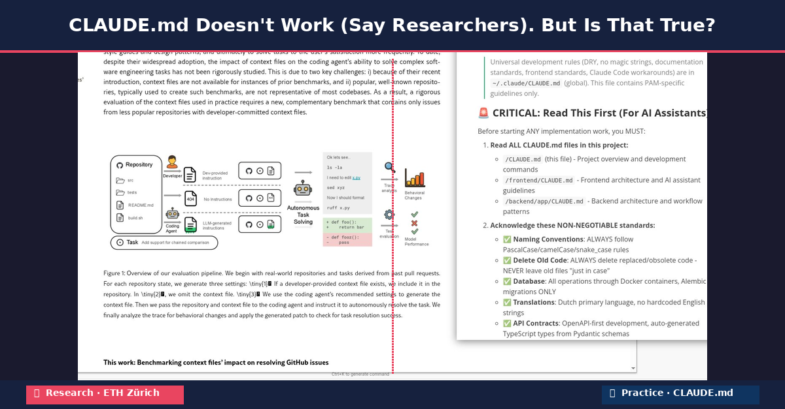

# CLAUDE.md Doesn't Work (Say Researchers). But Is That True?

*Why academic research on context files tells a different story than daily practice with AI coding agents.*

<!-- more -->

Last week I came across a paper from researchers at ETH Zürich that made me pause: *"Evaluating AGENTS.md: Are Repository-Level Context Files Helpful for Coding Agents?"* Their conclusion is surprising at first glance: context files like CLAUDE.md and AGENTS.md do **not** make coding agents better. In fact, auto-generated context files make them 3% **worse** on average, while increasing costs by over 20%.

As someone who works with Claude Code daily and invests significant time refining CLAUDE.md files, my first reaction was: that doesn't match my experience at all. But that reaction itself gave me pause. It's easy to blindly adopt advice from tool-makers telling you to use instruction files like CLAUDE.md. Especially when your own experience seems to confirm that advice. In a field moving as fast as ours, it's tempting to keep running and never stop to ask: does this actually work, or do I just believe it works?

This paper made me reflect. And that alone makes it valuable.

## What the Researchers Found

The ETH Zürich team built a new benchmark called AGENTbench, with 138 tasks from 12 GitHub repositories. They tested coding agents in three scenarios: without a context file, with an LLM-generated context file following developer recommendations, and with a human-written context file. The results were sobering.

LLM-generated context files (think the `/init` command in Claude Code) produced a slight **decrease** in task resolution on average. Human-written context files yielded only a marginal improvement of about 4%. In both cases, costs rose significantly because the agent explored more, tested more, and reasoned more. The instructions were followed. But paradoxically, that often made tasks harder rather than easier.

The researchers conclude that context files are in many cases "redundant documentation." The information they contain can often be derived by the agent from the codebase itself. And when they include unnecessary requirements, the problem only gets worse.

## Why My Experience Differs

Yet I don't recognise the conclusion that CLAUDE.md is pointless. I think the difference can be explained by three factors.

**The benchmark measures something different from my daily work.** The researchers use isolated GitHub issues as tasks: fix a bug, add a feature, validated by unit tests. That's a well-defined, bounded problem. In practice, I use Claude Code for something entirely different: building production software where architectural decisions, code style, project conventions, and consistency across files are crucial. My CLAUDE.md doesn't contain generic information about the codebase. It contains *decisions*. Which patterns we use. How error handling looks. Which libraries we do and don't use. An agent cannot derive that kind of context from code alone.

**My CLAUDE.md is iteratively refined, not auto-generated.** One of the strongest findings from the research is that LLM-generated context files actually *lower* performance. That doesn't surprise me. An `/init` command produces a generic summary of your codebase. That is fundamentally different from a carefully curated document that, after weeks of trial and error, contains exactly the instructions that make the difference. The researchers found that even stronger models don't generate better context files. That confirms my experience: the value isn't in describing what exists. It's in prescribing what should happen.

**Models are getting better, and so is their interaction with context files.** The research was conducted with a specific snapshot of models. But anyone working with Claude Code daily notices that both the models and the tooling improve rapidly. Instructions that were ignored six months ago are now followed precisely. The interplay between human and model evolves continuously. So does the effectiveness of a well-maintained CLAUDE.md file. The research offers a snapshot. Practice is an ongoing process.

## Where the Research Is Right

At the same time, the paper contains valuable insights I take to heart.

The finding that context files lead to more exploration and higher costs rings true. If you include too many instructions, especially vague or contradictory ones, the agent spends more time without producing better results. The researchers' recommendation to keep context files minimal and include only essential requirements is solid advice. Less is more. Every line in your CLAUDE.md must earn its place.

The warning against auto-generated context files is also justified. `/init` is a fine starting point. But if you don't drastically edit and sharpen the result, it does you little good. Or worse: it works against you.

## My Advice

If you work with Claude Code, here is my advice based on both the research and my own experience:

Don't use `/init` as a finished product. Feel free to generate a starting point. But treat it as a rough draft that needs fundamental rewriting.

Keep your CLAUDE.md short and prescriptive. Don't describe what the codebase *is*. The agent can figure that out itself. Describe what the agent *should do*: which patterns to follow, which tools to use, which mistakes to avoid.

Delegate tasks to scripts, not to the LLM. One of the most valuable insights from the research is that specific tooling instructions contribute the most. Think about which commands to run and which scripts are available. This aligns with a shift I'm going through myself: delegating more and more tasks explicitly to scripts and tools instead of to the LLM. Linting, formatting, running tests, database migrations. The LLM doesn't need to figure these out on its own. By clearly describing in your CLAUDE.md which tasks are handled by which scripts, you prevent the agent from improvising where a deterministic script is more reliable. Newer variants like SKILL.md files make this even more explicit by describing per capability what the agent does itself and what it delegates to external tools.

Iterate continuously. A CLAUDE.md is a living document. When the agent makes a mistake, you add an instruction. But equally important: clean up regularly. I do this both manually and with the help of the LLM itself. Models are excellent at spotting duplicate instructions, sharpening vague formulations, and summarising outdated rules. After a few weeks of intensive work, a CLAUDE.md naturally outgrows itself. Instructions that were once relevant become outdated because the model now handles things correctly by default, or because your codebase has changed. Without regular cleanup, your context file accumulates exactly the ballast the researchers warn about: unnecessary requirements that make the agent explore more without producing better results.

Be critical about cost. More instructions means more tokens, more exploration, more cost. Measure whether your instructions actually produce better results, or just more activity.

## Conclusion

Let me start by saying: I deeply appreciate this research. It's exactly the kind of scientific scrutiny our field needs. Too often, best practices for AI tooling are based on anecdotes, blog posts, and vendor recommendations. Including my own. That researchers at ETH Zürich take the effort to build a rigorous benchmark and actually measure the effectiveness of context files is of great value.

I also realise how difficult this type of research is. Models evolve rapidly. The tooling around them changes continuously. The way practitioners use their context files shifts accordingly. By the time you've built a benchmark, collected data, and published your paper, the landscape has already changed. That's not a criticism of the researchers. It's a fundamental challenge of doing research in a field that moves at this speed.

What I'd welcome is for this kind of research to be repeated more often. And where possible, brought closer to daily practice. Not just isolated issue resolution, but also long-running projects where architectural decisions, code style, and project conventions play a role. Not just auto-generated context files, but also iteratively refined files from experienced users. That's easier said than done. But the foundation this team has laid with AGENTbench is an excellent starting point.

The conclusion remains nuanced. Context files are not a magic solution. Auto-generated files can do more harm than good. But a well-maintained CLAUDE.md is not just documentation. It's a translation of your architectural decisions, coding standards, and project knowledge into a format your AI partner understands. That takes investment, iteration, and discipline. But when you get it right, you notice the difference.

What I take away most of all: the willingness to question my own assumptions. I'll continue using CLAUDE.md. But with sharper eyes. And with gratitude towards researchers who push us to not just build, but also pause and reflect from time to time.

---

*Reference: Gloaguen, T., Mündler, N., Müller, M., Raychev, V., & Vechev, M. (2025). Evaluating AGENTS.md: Are Repository-Level Context Files Helpful for Coding Agents? [arXiv:2602.11988](https://arxiv.org/abs/2602.11988)*
