# Automating GitHub Workflows with Custom Claude Code Skills

If you've ever managed a large GitHub issue with multiple sub-tasks, you know the drill: create sub-issues one by one, set up a tracking PR, manually update status tables, ensure all the `Closes #XXX` statements are in sync. It's tedious, error-prone, and takes 20-30 minutes of pure overhead for each large feature.

What if you could compress that entire workflow into a single command that takes 2 minutes?

<!-- more -->

## The Problem: GitHub Issue Management is Death by a Thousand Clicks

Here's what managing a complex feature traditionally looks like:

1. **Initial Decomposition** (10-15 minutes):
   - Read through the parent issue
   - Manually create 3-5 sub-issues with proper formatting
   - Set up a tracking PR with a status table
   - Add `Closes #XXX` statements for each sub-issue
   - Link everything together

2. **Ongoing Maintenance** (5-10 minutes per update):
   - Check which sub-issues are complete
   - Update the status table in the tracking PR
   - Verify all PRs are linked correctly
   - Add new sub-issues when bugs are discovered
   - Keep `Closes` statements synchronized

3. **Final Merge** (5 minutes):
   - Double-check all sub-issues are referenced
   - Ensure nothing falls through the cracks
   - Merge and hope GitHub auto-closes everything

**Total overhead per feature:** 30-45 minutes of pure administrative work. Multiply that by 10 features per month, and you've lost a full workday to GitHub bureaucracy.

## The Solution: Systematic AI Augmentation Through Custom Skills

Instead of fighting with GitHub's UI or writing one-off scripts, I built a suite of Claude Code skills that encode best practices into reusable automation. These skills transform complex workflows into simple commands.

### What Are Claude Code Skills?

[Claude Code](https://claude.com/product/claude-code) is Anthropic's CLI tool that brings Claude's AI capabilities directly into your terminal. Skills are markdown-based extensions that teach Claude new workflows. Think of them as specialized functions that Claude can execute on your behalf.

The key insight: **AI augmentation requires systematic tooling, not ad-hoc prompts.** Skills capture process knowledge and make it repeatable.

## The Skills: A Complete Issue Management System

I built six interconnected skills that handle the entire lifecycle of complex GitHub issues:



### The Workflow in Action

### 1. `/decompose` - Break Down Large Issues

The starting point for any complex feature. This skill analyzes a parent issue and intelligently breaks it into manageable sub-issues.

```bash
/decompose 723
```

**What it does:**

1. Fetches the issue using `gh issue view`
2. Analyzes the structure (phases, checklists, dependencies)
3. Proposes a breakdown with a clear table
4. Creates sub-issues after confirmation
5. Sets up a draft tracking PR with status table
6. Links everything together with `Closes` statements

**Example output:**

```markdown
## Proposed Sub-Issues for #723: Stripe Payment Provider

| #   | Sub-Issue Title                    | Depends On | Scope    |
| --- | ---------------------------------- | ---------- | -------- |
| 1   | Phase 1: Payment Abstraction Layer | -          | Backend  |
| 2   | Phase 2: Stripe Integration        | #1         | Backend  |
| 3   | Phase 3: Frontend Payment UI       | #1, #2     | Frontend |

Create these sub-issues? (A/B/C)
```

**Time saved:** 15 minutes → 2 minutes

### 2. `/bug` - Create Bug Sub-Issues

Found a bug while implementing a sub-issue? Don't break your flow.

```bash
# On branch issue-724-abstraction-layer
/bug "Webhook signature verification fails in test mode"
```

**What it does:**

1. Auto-detects parent issue from branch name (`issue-724-*`)
2. Creates a bug issue with proper prefix: `🐛 [Parent #724] Bug: Webhook signature verification fails`
3. Adds it to the tracking PR
4. Updates `Closes` statements automatically

**Time saved:** 5 minutes → 30 seconds

### 3. `/update-tracking` - Refresh Progress Status

After merging a few sub-issue PRs, update the tracking PR to reflect current progress.

```bash
/update-tracking 727
```

**What it does:**

1. Fetches status of all sub-issues
2. Checks for merged PRs linked to each sub-issue
3. Updates status emojis (⏳ Pending → ✅ Complete)
4. Recalculates progress percentage

**Before:**
```markdown
| #   | Sub-Issue                 | Status    | PR  |
| --- | ------------------------- | --------- | --- |
| 1   | #724 - Abstraction Layer  | ⏳ Pending | -   |
| 2   | #725 - Stripe Integration | ⏳ Pending | -   |

Progress: 0/2 (0%)
```

**After:**
```markdown
| #   | Sub-Issue                 | Status        | PR   |
| --- | ------------------------- | ------------- | ---- |
| 1   | #724 - Abstraction Layer  | ✅ Complete    | #731 |
| 2   | #725 - Stripe Integration | 🔄 In Progress | #732 |

Progress: 1/2 (50%)
```

**Time saved:** 5 minutes → 1 minute

### 4. `/extend` - Add More Sub-Issues

Realized you need to tackle another phase? Extend the existing tracking PR instead of creating chaos.

```bash
/extend 723
```

**What it does:**

1. Finds the existing tracking PR
2. Analyzes which tasks don't have sub-issues yet
3. Proposes new sub-issues
4. Adds them to the tracking PR and updates `Closes` statements

**Key difference from `/decompose`:** Works with existing structure, doesn't create a new PR.

**Time saved:** 10 minutes → 2 minutes

### 5. `/sync-closes` - Ensure Complete Issue Closure

Before merging, verify all sub-issues will auto-close when the tracking PR is merged.

```bash
/sync-closes 727
```

**What it does:**

1. Extracts all issue numbers from the status table
2. Compares with `Closes #XXX` statements in PR body
3. Identifies missing statements
4. Adds them after confirmation

**Example:**
```
Current Closes: #723, #724, #725
Found in table: #723, #724, #725, #730 (bug)

Missing: #730

Add "Closes #730" to PR? (y/n)
```

**Time saved:** 5 minutes → 1 minute

### 6. `/help-issues` - Quick Reference

Forgot the syntax? Get a quick reference card.

```bash
/help-issues
```

Returns the complete workflow guide with examples.

## Bonus: Workflow Skills for Complete Automation

Beyond issue management, I also created skills for the implementation workflow:

- **`/implement <issue>`** - Full guided workflow: fetch issue, plan, create branch, implement, test, create PR
- **`/cleanup`** - Post-merge cleanup: checkout base branch, fetch, pull, delete merged branch
- **`/finish <issue>`** - Complete workflow: commit, close issue, merge to base, cleanup

These encode mission-critical discipline into every step, ensuring nothing falls through the cracks.

## Real Impact: The Numbers

Let's quantify the time savings across a typical month:

| Task                 | Before     | After        | Per Month         | Saved      |
| -------------------- | ---------- | ------------ | ----------------- | ---------- |
| Decompose 5 features | 15 min × 5 | 2 min × 5    | 75 min vs 10 min  | **65 min** |
| Update tracking 20×  | 5 min × 20 | 1 min × 20   | 100 min vs 20 min | **80 min** |
| Create 10 bug issues | 5 min × 10 | 0.5 min × 10 | 50 min vs 5 min   | **45 min** |
| Sync before merge 5× | 5 min × 5  | 1 min × 5    | 25 min vs 5 min   | **20 min** |
| Extend tracking 3×   | 10 min × 3 | 2 min × 3    | 30 min vs 6 min   | **24 min** |

**Total monthly savings: 234 minutes (3.9 hours)**

But the real value isn't just time—it's **consistency**. Every decomposition follows the same structure. Every tracking PR has the same format. Every `Closes` statement is synchronized. Zero human error.

## How It Works Under the Hood

Each skill is a markdown file in `~/.claude/skills/<skill-name>/SKILL.md` with three key sections:

1. **Metadata** (YAML frontmatter):
```yaml
---
name: decompose
description: Decompose a large GitHub issue into sub-issues
argument-hint: <issue-number>
user-invocable: true
---
```

2. **Workflow Instructions:**
```markdown
## Workflow

### Step 1: Fetch and Analyze
```bash
gh issue view $ARGUMENTS --json title,body,labels
```
Analyze phases, dependencies, logical groupings...

### Step 2: Propose Breakdown
Present table to user with A/B/C options...
```

3. **Error Handling & Best Practices:**
```markdown
## Important Notes
- Always ask before creating
- Preserve original content
- Use consistent naming: `issue-[number]-[feature]`
```

When you invoke `/decompose 723`, Claude:
1. Loads the skill prompt
2. Substitutes `$ARGUMENTS` with `723`
3. Executes the workflow step-by-step
4. Uses `gh` CLI for GitHub operations
5. Asks for confirmation at critical points

## Lessons Learned

### What Worked

**1. Encoding best practices directly in skills**

Instead of remembering to add `Closes` statements, the skill does it automatically. Instead of manually formatting status tables, the skill uses a template.

**2. Confirmation gates at the right places**

Skills ask for user confirmation before creating issues/PRs, but automate everything else. This balances control with efficiency.

**3. Smart defaults with explicit overrides**

Branch name detection auto-extracts issue numbers (`issue-724-*` → `#724`), but you can always provide explicit parameters.

**4. Composable workflows**

Skills work independently but integrate seamlessly. `/bug` automatically updates the tracking PR created by `/decompose`.

### What Was Challenging

**1. Handling edge cases gracefully**

What if the tracking PR doesn't exist? What if the branch name doesn't follow conventions? The skills need defensive checks without becoming brittle.

**2. Balancing automation with transparency**

Users need to see what's happening (especially with GitHub API calls), but too much output is noise. I settled on showing key operations with clear progress indicators.

**3. GitHub CLI quirks**

The `gh` CLI is powerful but has subtle behaviors (like how it handles multi-line PR bodies). Skills need to use heredocs and proper escaping.

## Why This Matters

This project embodies what I mean by **AI augmentation for mission-critical systems**:

1. **Systematic, not ad-hoc** - Skills capture repeatable processes, not one-off prompts
2. **Reliable and predictable** - Same input always produces same output
3. **Human-in-the-loop** - Automation handles tedium, humans make decisions
4. **Fail-safe design** - Confirmation gates prevent destructive operations

This is the same discipline I apply when architecting AI systems for finance, healthcare, and defense clients—but scaled down to developer productivity.

The meta-lesson: **Effective AI augmentation requires treating automation itself as mission-critical infrastructure.** These skills aren't clever hacks; they're maintainable, testable, documented tools.

## Try It Yourself

Want to build your own Claude Code skills? Here's how to start:

1. **Install Claude Code**: Follow the instructions at [claude.com/product/claude-code](https://claude.com/product/claude-code)

2. **Create a skill directory:**
```bash
mkdir -p ~/.claude/skills/my-skill
```

3. **Write a skill file** (`~/.claude/skills/my-skill/SKILL.md`):
```yaml
---
name: my-skill
description: What your skill does
user-invocable: true
---

# My Skill

Help the user accomplish [specific task].

## Input
The user provides: `$ARGUMENTS`

## Workflow
1. Do this
2. Then that
3. Finally this
```

4. **Restart Claude Code** to reload skills

5. **Test it:**
```bash
/my-skill some-argument
```

The complete source for my issue management skills is available in my `~/.claude/skills/` directory. Check the [README.md](https://github.com/anthropics/claude-code) for detailed documentation.

## Get the Skills

All six issue management skills plus the workflow automation skills are now available as open source:

**[View on GitHub →](https://github.com/JanKeijzer/claude-code-toolkit)**

The repository includes:

- Complete skill source code for all 9 skills
- Installation instructions
- Usage examples and demos
- Best practices guide

## What's Next?

I'm exploring skills for:

- **Code review automation** - Extract common patterns from review feedback and apply them systematically
- **Migration workflows** - Multi-step codebase migrations with checkpoints and rollback
- **Documentation generation** - Auto-generate API docs from code with intelligent summaries

The potential for AI augmentation through systematic tooling is enormous. We're just scratching the surface.

## Get in Touch

If you're interested in AI augmentation for your team's workflows—or need help architecting AI systems with mission-critical reliability—[let's talk](https://calendly.com/imperial-automation/introduction-call).

I'd also love to hear about the workflows you'd automate if you had the right tools. What takes 30 minutes today that could take 2 minutes tomorrow?

---

**Want to discuss your AI automation challenges?** [Schedule a call](https://calendly.com/imperial-automation/introduction-call) or [connect on LinkedIn](https://linkedin.com/in/jankeijzer).
