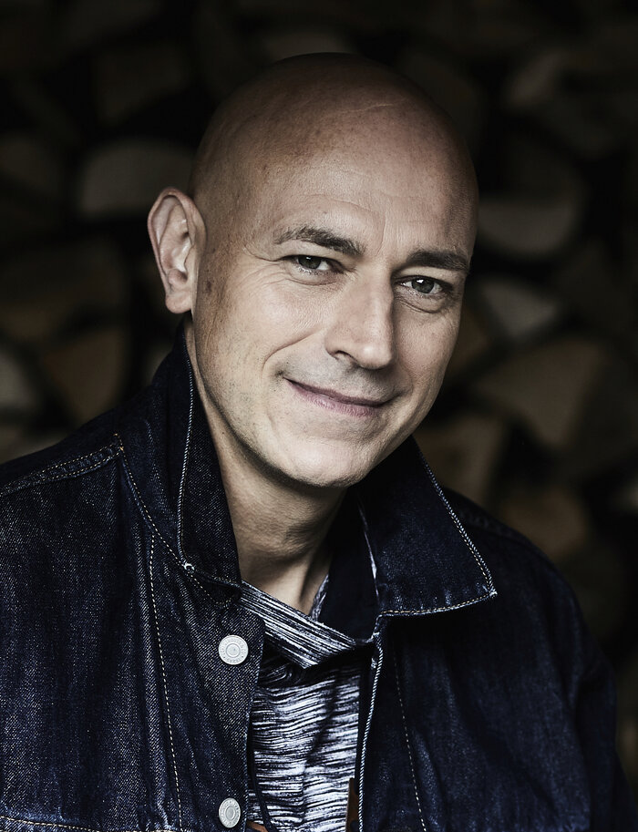

# Turn friction into flow

### 30+ years turning complex technical challenges into business results

- Is your team losing hours to repetitive tasks that should be automated?

- Are operational bottlenecks preventing your business from scaling?

- Do you need someone who can both architect and build the solution?

- Looking for proven expertise across multiple industries and technologies?

- Want a consultant who delivers working systems, not just slide decks?

[Book Free Strategy Call :material-arrow-top-right:](https://calendly.com/imperial-automation/introduction-call){ .md-button .md-button--primary target="_blank" rel="noopener" }

{ .profile-image alt="Portrait of Jan, AI Automation Consultant at Imperial Automation" }

## About me

I'm Jan, an AI automation consultant based in the Netherlands, working with European businesses that are ready to transform operational bottlenecks into competitive advantages. If your organization is losing valuable time to manual processes, struggling to scale operations, or watching competitors pull ahead with smarter systems—I can help you change that.

My background is anything but typical for this field. I hold a PhD in Nuclear Reactor Physics from TU Delft, which gave me a rigorous foundation in complex systems thinking and analytical problem-solving. Over the past three decades, I've built mission-critical systems across healthcare, aerospace, defense, and finance—sectors where downtime costs lives, money, or missions. From 24/7 alarm systems to banking platforms with financial penalties for outages, I've learned to build systems that simply cannot fail.

I've helped scale companies like DirectorInsight and Zintouch from small teams to 40-50 employees, engineering infrastructure to support 100% YoY user growth. In 2025, I earned my certification as a Datalumina AI Engineer, combining my deep development expertise with cutting-edge AI capabilities.

My tech stack spans Python, modern AI frameworks, API development, database architecture, and enterprise integration. But more importantly, I understand how technology serves business goals—not the other way around.

## Why work with me?

Here's what sets me apart and how I can help transform your operations:

-   :fontawesome-solid-cogs:{ .lg .middle } Builder, Not Just Advisor

    ---

    I don't hand you a report and walk away. I architect solutions, build them hands-on, or lead your dev team to delivery. You get a technical co-founder mindset applied to your automation challenges—someone who writes the code, not just the recommendations.

-   :material-chart-line:{ .lg .middle } Proven Scale Experience

    ---

    I've built the systems that enabled companies to grow from small teams to 40-50 employees. I understand what breaks at scale and how to build automation that grows with your business, not against it.

-   :material-shield-check:{ .lg .middle } Enterprise-Grade Background

    ---

    Three decades across healthcare, aerospace, defense, and finance means I understand compliance, security, and reliability requirements. Your automation will be built to standards that matter.

-   :material-head-lightbulb:{ .lg .middle } Scientific Rigor

    ---

    A PhD trains you to solve problems others consider impossible. I bring that same analytical depth to understanding your bottlenecks and designing solutions that address root causes, not symptoms.

-   :material-server-network:{ .lg .middle } Mission-Critical Mindset

    ---

    Three decades building systems where failure isn't an option—from life-safety alarm systems to financial trading platforms with downtime penalties, from spacecraft systems to national infrastructure. I design for zero-downtime upgrades and build reliability into every layer.

## Industries & expertise

-   :material-hospital-building:{ .lg .middle } Healthcare

    ---

    Built mission-critical alarm systems at Zintouch requiring 24/7 availability where downtime could cost lives. Supported year-over-year user base doubling through management dashboards, third-party integrations, and expanded alarm system support—all while maintaining zero-downtime upgrades. Deep experience with GDPR, medical data standards, and high-stakes reliability.

-   :material-finance:{ .lg .middle } Finance

    ---

    Developed solutions at DirectorInsight for financial reporting and analysis, scaling 24/7 infrastructure to support global users and year-over-year user growth doubling. Experience with regulatory requirements, audit trails, and the precision financial systems demand.

-   :material-airplane:{ .lg .middle } Aerospace & Defense

    ---

    Worked with ESA, TNO, and Atos on spacecraft and defense systems where failure isn't an option—once in space, there are no repairs. This background shapes how I approach reliability and testing in every project.

-   :material-bank:{ .lg .middle } Banking & Trading

    ---

    Built trading systems at ABN AMRO with financial penalties for downtime. When missed orders cost real money and market opportunities vanish in seconds, you learn to build systems that never fail.

-   :material-office-building:{ .lg .middle } Enterprise Integration

    ---

    Specialized in connecting disparate systems, automating data flows, and building bridges between legacy infrastructure and modern AI capabilities.

## Frequently asked questions

??? note "What kind of automation projects do you take on?"
    I focus on high-ROI automation opportunities—processes that consume significant manual effort, create bottlenecks, or prevent scaling. This includes document processing, data pipeline automation, workflow optimization, and AI-enhanced business processes. I'm selective about projects to ensure I can deliver meaningful results.

??? note "Do you work remotely with European clients?"
    Yes, Imperial Automation is built for remote collaboration across Europe. I use modern communication tools, provide regular progress updates, and can accommodate different time zones. For larger engagements, I'm available for on-site workshops when needed.

??? note "What's your approach to a new project?"
    I start with a focused discovery phase to understand your bottleneck, quantify the impact, and identify the right solution approach. I provide a clear proposal with expected ROI before any development begins. No surprises, no scope creep.

??? note "How do you handle data security?"
    With my background in defense and healthcare, security isn't an afterthought—it's foundational. I sign comprehensive NDAs, follow enterprise security practices, and can work within your existing security infrastructure. GDPR compliance is standard.

??? note "What's your pricing model?"
    I work on a project basis with clear deliverables and timelines. Pricing reflects the value delivered and complexity involved, not hours logged. For ongoing automation support, I offer retainer arrangements. Let's discuss your specific situation to find the right structure.

??? note "How quickly can you start?"
    Typically within 1-2 weeks of agreement. For urgent situations, I can often accommodate faster starts. The discovery phase usually takes 1-2 weeks, followed by a detailed proposal before development begins.

??? note "What if we're not sure automation is the right solution?"
    That's exactly what the initial strategy call is for. I'll help you evaluate whether automation makes sense for your situation, estimate potential ROI, and identify the best approach. No obligation, no pressure—just honest assessment.

-   :material-coffee:{ .lg .middle } Let's discuss your bottleneck

    ---

    Every automation journey starts with understanding the problem. Schedule a free 30-minute strategy call to explore your challenges and see if we're a good fit.

    [Book Free Strategy Call :material-arrow-top-right:](https://calendly.com/imperial-automation/introduction-call){ .md-button .md-button--primary target="_blank" rel="noopener" }

