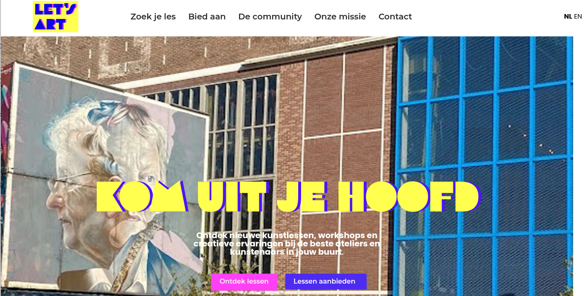
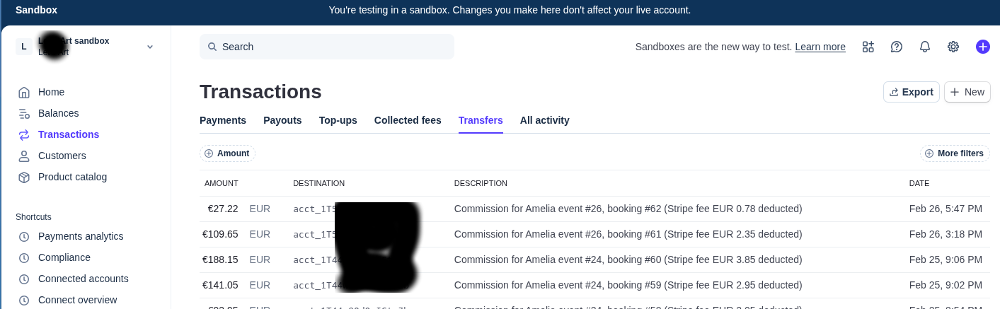

# Let's Art Amsterdam

**Three weeks of friction. One week to flow.**

[:material-arrow-left: Back to Portfolio](../index.md)

*Let's Art Amsterdam — a creative marketplace where people discover and book workshops with local artists and studios.*

!!! abstract "Project Summary"
    **Client**: Let's Art Amsterdam
    **Industry**: Creative marketplace / E-commerce
    **Timeline**: 1 week (after 3 weeks stalled)

    **Key outcomes**:

    - Payment flow live and processing real bookings
    - iDEAL and card payments enabled for Dutch market
    - Automatic 80/20 commission split between hosts and platform
    - Compliant PDF invoices generated and emailed automatically
    - Platform launched on schedule

---

## The Client

A Dutch creative marketplace where people can discover and book workshops with local artists and studios. The founder had poured months into building the platform and had a firm launch date in sight. What she didn't have was a working payment flow — and after three weeks of trying to get Stripe Connect configured, the launch was hanging by a thread.

## The Challenge

The platform runs on a commission model: customers pay for a workshop, 80% flows to the workshop host, and the platform keeps 20%. Simple in principle. In practice, getting Stripe Connect to do that reliably — in a WordPress environment, with a booking plugin, for a Dutch audience — had become a wall.

There was another problem underneath: without a proper test environment, every attempt to verify the payment flow meant making a real charge. That felt too costly and too risky, so testing wasn't happening. The result was a platform that looked ready but hadn't been validated end-to-end. Nobody knew if it actually worked.

## What I Found

The first thing I did was set up a local mirror of the live site — a full copy, running on my machine, with a zrok tunnel connecting it to Stripe's test environment. Within an hour I had the WordPress site running locally with a stable HTTPS endpoint that Stripe could reach. No risk to the live site, no real charges, no guesswork. Just clean, fast iteration.

With that in place, the diagnosis was straightforward:

- **Two payment systems running in parallel**, both trying to handle the commission split, conflicting with each other
- **Commission percentage configured backwards** — vendors were set to receive 20%, not 80%
- **iDEAL not enabled** — the dominant payment method in the Netherlands was missing entirely
- **No invoicing** — a legal requirement in the Dutch market

The underlying platform was solid. The booking system, the page builder, the content structure — all fine. What was broken was the financial layer, and now it could be fixed safely.

I used Claude Code throughout the diagnosis: mapping the existing plugin code, tracing the payment flow, and pinpointing exactly where things diverged from the intended behaviour.

## What I Built

Rather than patch the existing plugin, I rebuilt it cleanly. The new plugin replaces the booking widget's card fields with a redirect to Stripe Checkout — giving customers both iDEAL and card as payment options. When a payment completes, a webhook triggers the commission split automatically: 80% transfers to the vendor's connected Stripe account, server-side, reliably.

Every successful payment generates two PDF invoices automatically — one for the customer with a VAT breakdown, one for the vendor showing their net payout after platform fee and transaction costs. Both arrive by email within seconds. The plugin is fully internationalised, with English and Dutch supported out of the box.

*Stripe Connect dashboard showing automated commission transfers to workshop hosts.*

Claude Code was used throughout the build — for code generation, review, and testing — with all output verified before it touched production.

## The Result

The founder had spent three weeks stuck. The project took one. Seven days after I started, the full payment flow was live: customers booking, iDEAL payments processing, commissions splitting automatically, compliant invoices landing in inboxes. The platform launched on schedule.

That's the shift I aim for on every project — not just fixing what's broken, but removing the friction that was making progress impossible in the first place.

## Technologies

- **Platform**: WordPress, Amelia booking plugin
- **Payments**: Stripe Connect, Stripe Checkout, webhooks
- **Backend**: PHP, custom WordPress plugin
- **AI-assisted development**: Claude Code
- **Testing**: Local environment with zrok tunnel to Stripe test mode

---

-   :material-coffee:{ .lg .middle } Stuck on a technical problem that's blocking your launch?

    ---

    Let's talk about how I can help you move forward. Schedule a free 30-minute call.

    [Book a Free Call :material-arrow-top-right:](https://calendly.com/imperial-automation/introduction-call){ .md-button .md-button--primary target="_blank" rel="noopener" }

[:material-arrow-left: Back to Portfolio](../index.md)
